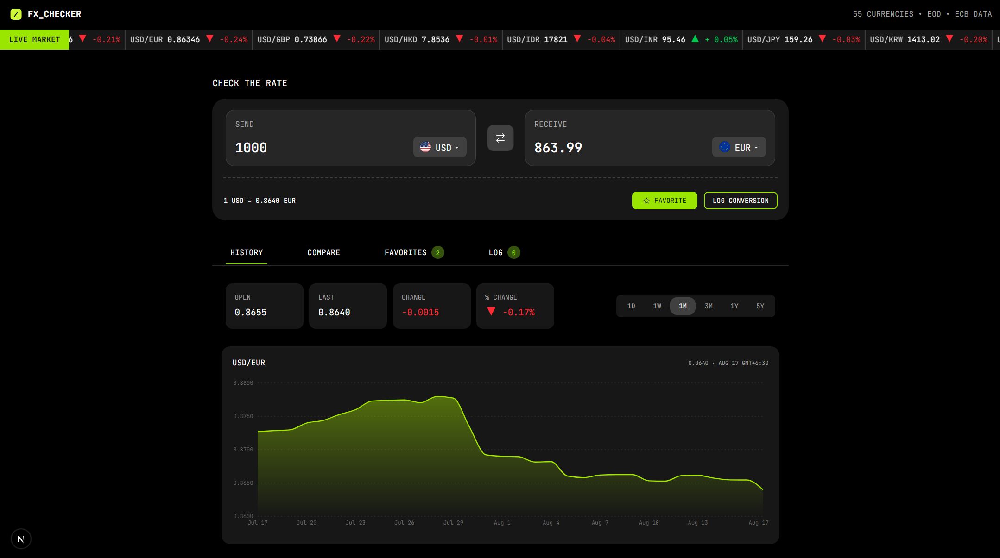

# Currency Exchange Dashboard

A currency exchange dashboard built with Next.js, TypeScript, and Tailwind CSS.

I built this project to practice working with real exchange-rate data and to create a more complete experience than a simple currency converter. Users can convert currencies, compare rates, save favorite pairs, view historical data, and keep track of previous conversions.

## Preview



## Features

- Currency conversion with live exchange rates
- Swap between currencies
- Search and select currencies
- Compare one amount across multiple currencies
- Save favorite currency pairs
- View historical exchange rates with an interactive chart
- View market statistics and daily changes
- Keep a local conversion history
- Delete individual conversions or clear the entire history
- Responsive layout for mobile and desktop
- Loading, error, and empty states
- Keyboard-friendly and accessible controls

## Tech Stack

- Next.js
- React
- TypeScript
- Tailwind CSS
- Recharts
- React Icons
- Frankfurter API
- localStorage

## API

Exchange-rate data comes from the [Frankfurter API](https://www.frankfurter.app/).

The API is used for current rates, historical rates, currency comparisons, and favorite pair data.

No API key is required.

## Local Storage

Favorites and conversion history are stored in the browser using `localStorage`.

Conversion logs include:

- Currency pair
- Amount sent
- Amount received
- Timestamp
- Unique ID

## Accessibility

I added accessibility support to the main interactive parts of the application, including:

- Keyboard focus states
- Screen-reader labels
- Accessible icon buttons
- ARIA states for interactive controls
- Accessible loading and error messages
- Semantic HTML
- Support for keyboard navigation

## Getting Started

Clone the repository:

```bash
git clone https://github.com/peterpaing/fx-checker.git
```

### Navigate to the project

```bash
cd fx-checker
```

### Install dependencies

```bash
npm install
```

### Start the development server

```bash
npm run dev
```

Open [http://localhost:3000](http://localhost:3000) in your browser.

## Production Build

Create a production build:

```bash
npm run build
```

Start the production server:

```bash
npm start
```

## Project Structure

```text
app/
├── compare/
├── favorites/
├── log/
├── ...
├── component/
├── data/
└── lib/
```

## What I Practiced

This project gave me hands-on experience with:

- Working with external APIs
- Managing shared state with React Context
- Handling asynchronous requests
- Building loading and error states
- Using localStorage for client-side data
- Creating interactive charts with Recharts
- Building responsive layouts with Tailwind CSS
- Improving accessibility
- Organizing reusable React components

## Future Improvements

- Add user authentication
- Sync favorites across devices
- Add a backend database
- Add more advanced market analytics
- Add automated tests
- Improve offline support
- Add more customizable dashboard features

## License

This project was built as a portfolio project for learning and demonstration purposes.